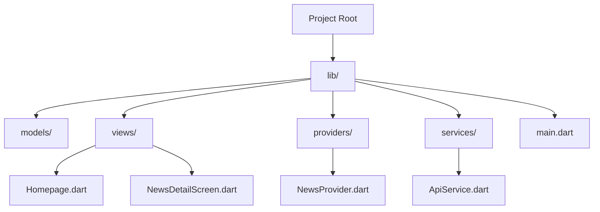

# 📰 News App  

A modern and minimalistic **News App** built with **Flutter**, featuring real-time news updates, article details, and smooth UI/UX.  

## 📌 Features  

✔️ **Latest News Feed** – Fetch and display real-time news articles  
✔️ **Article Details** – Open full articles with images and descriptions  
✔️ **Smooth Navigation** – Navigate seamlessly between news categories  
✔️ **Dark Mode Support** 🌙  
✔️ **Cached Images** – Optimized performance with `cached_network_image`  

## 📸 Screenshots  

  

## 🏗 Project Structure  



## 🚀 Getting Started  

### 📌 Prerequisites  

- Flutter SDK installed  
- Dart SDK installed  

### 📥 Installation  

1️⃣ Clone the repository:  
```sh
git clone https://github.com/engbasel/News-App.git
```
2️⃣ Navigate to the project directory:  
```sh
cd News-App
```
3️⃣ Install dependencies:  
```sh
flutter pub get
```
4️⃣ Run the app:  
```sh
flutter run
```

## 📂 APK Download  

🔗 [Download APKs](https://drive.google.com/drive/folders/1O6bwDWD5rqDHTzWNHCbdi6FX307Y0I04?usp=sharing)  

## 🤝 Contributors  

👨‍💻 **Basel Embaby**  
📧 [Email](mailto:basel.a.embaby@gmail.com)  
🔗 [LinkedIn](https://linkedin.com/in/basel-embaby)  
🐙 [GitHub](https://github.com/engbasel)  

## 📝 License  

📄 This project is licensed under the **MIT License** – see the [LICENSE](LICENSE) file for details.  
